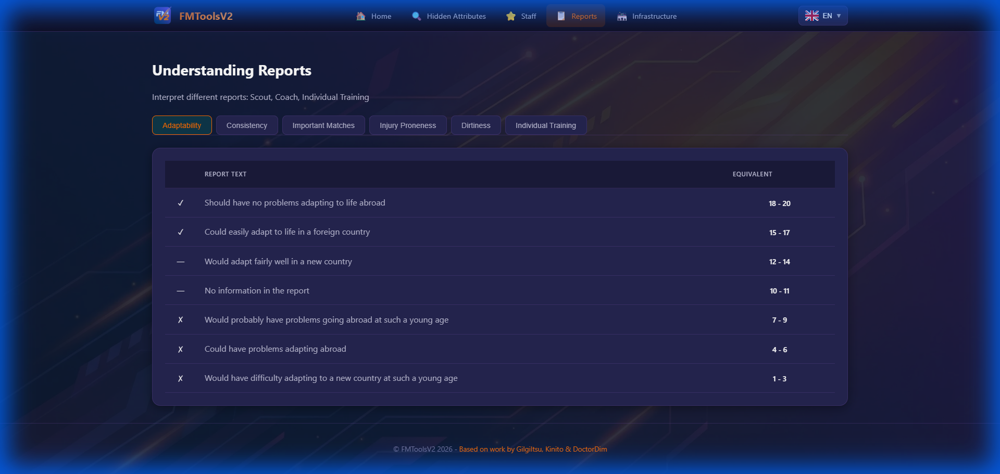

<p align="center">
  
</p>

<h1 align="center">FMToolsV2</h1>

<h4 align="center">📖 Read in your language</h4>

<p align="center">
  <a href="README_zh.md"></a>&nbsp;
  <a href="README_ko.md"></a>&nbsp;
  <a href="README_da.md"></a>&nbsp;
  <a href="README_de.md"></a>&nbsp;
  <a href="README_el.md"></a>&nbsp;
  <a href="README.md"></a>&nbsp;
  <a href="README_es.md"></a>&nbsp;
  <a href="README_fr.md"></a>&nbsp;
  <a href="README_it.md"></a>&nbsp;
  <a href="README_nl.md"></a>&nbsp;
  <a href="README_pl.md"></a>&nbsp;
  <a href="README_pt.md"></a>&nbsp;
  <a href="README_sv.md"></a>&nbsp;
</p>

---


**Evaluation Tools for Football Manager 26**

Welcome to the player and staff evaluation tool

## Description
After numerous tests on Football Manager in recent years, Kinito and DoctorDim have allowed us to understand important aspects of the game in depth. Using their work for the community, I was able to create this small tool that will help you better understand the management of your squad and your club.

## Features
- **Hidden Attributes**: Evaluate a player's hidden attributes using: Personality, Media Handling, Determination
- **Staff**: Evaluate staff to best meet your needs. In FM26, attributes are displayed with descriptive words.
- **Reports**: Interpret different reports: Scout, Coach, Individual Training
- **Infrastructure**: Know and evaluate your club's infrastructure development.

## Screenshots

<p align="center">
  
</p>

<p align="center">
  
</p>

## Installation
1. Download the latest version from [Releases](https://github.com/AnthonyMahe/FMToolsV2/releases)
2. Run the executable (Windows) or AppImage (Linux)

## 🔒 Security Verification
All releases are cryptographically signed and verified:
- **SHA256 Checksums**: Compare with `checksums_windows.txt` / `checksums_linux.txt`
- **GitHub Attestations**: Verify build provenance with:
```bash
gh attestation verify <downloaded-file> --owner AnthonyMahe
```

## Supported Languages (FM26 Official)
 Français |  English |  Deutsch |  Español |  Italiano |  Português |  Nederlands |  Polski |  Ελληνικά |  Svenska |  Dansk |  简体中文 |  한국어

## Check my other projects
- [**NewGAN-Manager-26**](https://github.com/AnthonyMahe/NewGAN-Manager-26)

## Credits
Based on work by Gilgiltsu, Kinito & DoctorDim

## Support This Project
<a href="https://liberapay.com/TonyBoySUPER/donate"></a>
